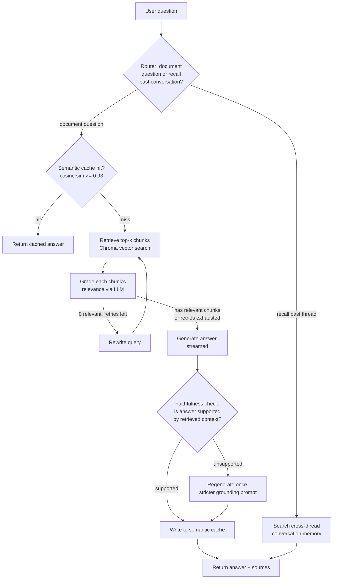
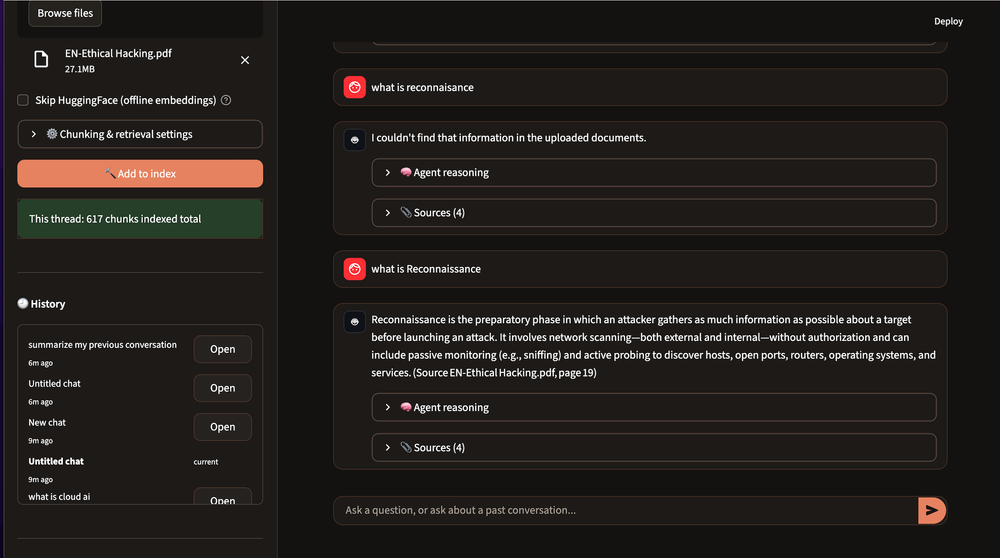
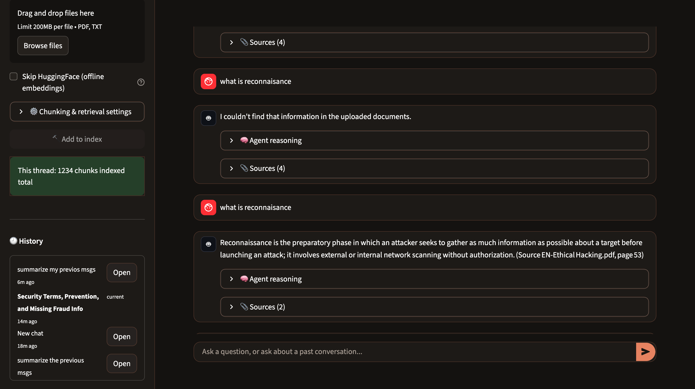
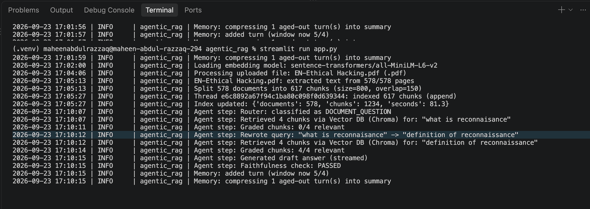

# Agentic RAG Document Assistant

A document Q&A agent built on a hand-written retrieve → grade → rewrite → generate → verify
control loop (no LangGraph/agent framework — the state machine is implemented directly in
Python), with per-thread persistence, semantic caching, and cross-session memory.

## What this is

Upload one or more PDF/TXT documents into a chat thread and ask questions about them. The
agent doesn't just retrieve-and-answer — it grades its own retrieval, rewrites the query and
retries when the first pass comes back irrelevant, and checks its own answer against the
retrieved context before returning it.

## Architecture



## Implemented

- **Intent routing** — classifies each question as a document lookup vs. a request to recall
  a past conversation, before doing any retrieval work.
- **CRAG-style self-correcting retrieval** — retrieved chunks are graded for relevance by an
  LLM (not just ranked by embedding similarity). If grading rejects everything, the query is
  rewritten and retrieval retries, up to a configured retry limit.
- **Faithfulness checking** — the drafted answer is checked against the actual retrieved
  context after generation; an unsupported answer triggers one regeneration with a stricter
  grounding prompt.
- **Semantic answer cache** — near-duplicate questions (cosine similarity ≥ 0.93) within the
  same thread skip regeneration entirely, scoped per-thread so cached answers never leak
  across different document sets.
- **Per-thread document isolation** — each chat thread has its own Chroma collection;
  documents uploaded to one thread never surface in another.
- **Cross-thread conversation memory** — finalized threads are summarized and indexed
  separately, searchable when a question asks to recall a past conversation rather than the
  current thread's documents.
- **Separate prompt/context formatting for document vs. memory answers** — recall answers use
  a distinct prompt template and context formatter from document answers, so the model is
  never instructed to cite a document page number for a past-conversation summary (an earlier
  version shared one template across both and occasionally fabricated citations as a result).
- **Sliding-window conversation memory with rolling summarization** — the last N turns are
  kept verbatim; older turns are compressed into a running summary via a small/cheap model,
  keeping prompt token cost roughly constant regardless of conversation length.
- **Offline embedding fallback** — if HuggingFace is unreachable, falls back to a local
  hashing-based embedder (no network call, lower semantic accuracy) rather than failing.
- **Streaming responses** with a live, step-by-step reasoning trace shown in the UI.

## Not yet implemented

- **Reranking.** Retrieval is single-pass dense vector similarity only, no cross-encoder
  reranking step over a wider candidate set — see Debugging Notes below for a reproduced case
  where this gap caused an unnecessary refusal.
- **Hybrid / BM25 search.** No lexical/keyword retrieval; purely embedding-based, which can
  under-rank chunks containing exact terms (codes, tool names) the embedding model doesn't
  weight heavily.
- **Query expansion (multi-query / HyDE).** Query rewriting exists but only triggers
  reactively after a failed grading pass, not proactively for vague queries.
- **Multi-hop retrieval.** A single retrieve → grade cycle per question; compound questions
  requiring facts from multiple separate chunks aren't explicitly decomposed.
- **Automated evaluation harness.** No labeled golden question set or scripted
  retrieval-precision / faithfulness-pass-rate measurement yet — currently verified by manual
  spot-checking, which is a known limitation (see Debugging Notes below).
- **Structured tracing** (e.g. LangSmith/Langfuse) — currently relies on application-level
  logging only.
- **Boilerplate-aware chunking.** Repeated document headers/footers are not stripped before
  chunking, which can dilute chunk-level topic signal.
- **Relevance grading on memory recall.** Document retrieval is graded before reaching
  generation (see Implemented); cross-thread memory retrieval is not — recall questions
  generate from the top-k closest past-thread summaries with no relevance filter or threshold.
  With few finalized threads this rarely matters; as more accumulate, a recall question could
  surface an unrelated past thread's summary without any correction loop catching it.

## Tech stack

- **UI:** Streamlit
- **Orchestration:** hand-written state machine (`AgentState` dataclass threaded through
  pipeline functions), not a framework — see Debugging Notes for why this mattered
- **LLMs:** Groq — `openai/gpt-oss-120b` for generation, `openai/gpt-oss-20b` for routing,
  grading, query rewriting, faithfulness checking, and memory summarization
- **Embeddings:** `sentence-transformers/all-MiniLM-L6-v2` (HuggingFace), with a local
  hashing-based offline fallback
- **Vector store:** Chroma (persistent, on-disk)
- **Chat/thread persistence:** SQLite

## Setup

```bash
python -m venv .venv
source .venv/bin/activate  # Windows: .venv\Scripts\activate
pip install -r requirements.txt
```

Create a `.env` file:

```
GROQ_API_KEY=your_own_key_here
```

Get a free key at [console.groq.com/keys](https://console.groq.com/keys). Note: available
models depend on your specific key/project scope — run the models endpoint yourself to confirm
what's available before assuming a model name works:

```python
import os, requests
from dotenv import load_dotenv
load_dotenv()
resp = requests.get(
    "https://api.groq.com/openai/v1/models",
    headers={"Authorization": f"Bearer {os.environ['GROQ_API_KEY']}"},
)
for m in resp.json().get("data", []):
    print(m["id"])
```

Run:

```bash
streamlit run app.py
```

## Debugging notes (observability, not just a feature list)

Early versions of this project had a bug worth documenting rather than hiding: the relevance
grading step was silently fail-opening on every single call due to an inaccessible model name,
meaning every retrieved chunk was marked "relevant" regardless of actual content — for weeks,
retrieval grading was a no-op wrapped in a working-looking system. The failure was invisible
because exceptions were caught and logged to stdout only, never surfaced in the UI or the
agent's own reasoning trace.

Fixed by:
1. Making failures visible in the reasoning trace itself, not just server logs.
2. Verifying against the actual persisted trace data in SQLite rather than trusting the UI.
3. Confirming the real root cause via the Groq API's own model-list endpoint instead of
   guessing a replacement model name.

Screenshots below show the same query (`"what is reconnaisance"`, a misspelled query that
should not match documents about credit card fraud statutes and Trojans) before and after the
fix — before, grading rubber-stamped irrelevant chunks; after, grading correctly rejects them
and the query-rewrite retry loop fires for the first time, producing the correct answer.

**Before fix** — grading passes irrelevant chunks, wrong answer:



**After fix** — grading correctly rejects irrelevant chunks, rewrite loop triggers, correct answer:



**Terminal log — failure now visible, root cause traceable:**



### Second incident: thin retrieved chunks causing an unnecessary refusal

Not a bug in the traditional sense — this is the faithfulness checker working exactly as
designed, and in doing so exposing a genuine retrieval-quality gap.

Asking `"wt is ethical hacking"` retrieved 4 chunks, all correctly graded relevant by topic
(page 1 "Ethical Hacking Introduction", page 12 "Module I Introduction to Ethical Hacking",
plus pages 123 and 404). Grading and topic-matching both worked correctly. But the actual
chunk content was mostly section-header text pulled from a slide-style PDF, not body
paragraphs containing an actual definition. The generator drafted an answer anyway; the
faithfulness checker correctly flagged it `UNSUPPORTED` because the claims weren't backed by
the thin context it was given, triggered a stricter regeneration, and — with no real defining
sentence present in any of the 4 chunks — the honest outcome was a refusal instead of a
fabricated-sounding definition.

Root cause: single-pass k=4 dense similarity retrieval with no reranking. The actual defining
sentence for "ethical hacking" almost certainly exists a page or two away, but lost out on
embedding-distance alone to several topically-adjacent header-only chunks that made the top-4
instead.

This is the concrete, reproduced case behind the Reranking item in Not yet implemented: a
wider first-pass retrieval (e.g. k=15) followed by a cross-encoder reranking step to select the
strongest 4 candidates would directly address this failure mode, rather than relying on raw
embedding distance alone to decide what the generator sees.

### Observed, not yet root-caused: recall-answer confidence is inconsistent


Two reproduced examples, worth keeping distinct rather than treating as one finding:

1. Asking the identical string "summarize my previos msgs" twice in immediate succession
   produced a refusal the first time and a full, correct answer the second — same router
   decision, same single retrieved source both times. This points to genuine generation-time
   variance (`temperature=0` reduces but does not eliminate this on Groq's serving stack).
2. Asking two differently-worded but equivalent questions ("give me summary of my past 3-4
   msgs" vs. "summarize my previous msgs") retrieved the same two memory sources but in
   reversed order — expected, since different wording produces a different embedding vector —
   and again produced a refusal on one phrasing, a correct answer on the other.

Neither has a fix yet. Together they're the concrete case for the missing automated evaluation
harness above: a scripted run of several paraphrased variants of the same question, repeated
multiple times each, would quantify how often this happens instead of relying on manual,
lucky reproduction to notice it at all.

## Known limitations

- Duplicate document uploads into the same thread are not deduplicated — re-uploading the
  same file appends a second full copy of its chunks.
- No automated test suite.
- Single-user local persistence (SQLite, Chroma on local disk) — not designed for concurrent
  multi-user deployment as-is.